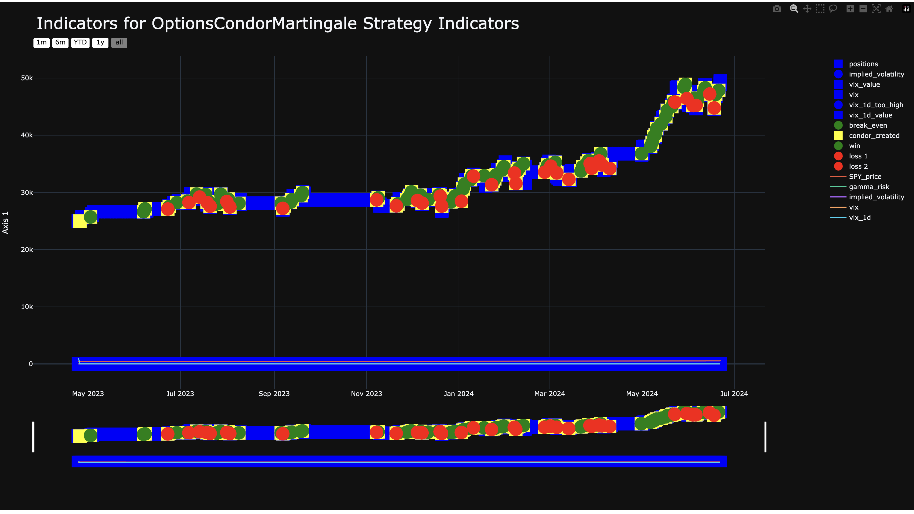

.. _backtesting.indicators_files:

Indicators Files
================

.. meta::
   :description: Plot strategy indicators with add_marker, add_line, and add_ohlc. Inspect their values in the Indicators HTML chart and exported CSV file.

The **Indicators HTML** and **Indicators CSV** files contain data on the indicators used in the strategy. Populate them with these chart functions:

- :doc:`add_marker() <strategy_methods.chart/lumibot.strategies.strategy.Strategy.add_marker>`: Adds markers to the indicators.
- :doc:`add_line() <strategy_methods.chart/lumibot.strategies.strategy.Strategy.add_line>`: Adds lines to the indicators.
- :doc:`add_ohlc() <strategy_methods.chart/lumibot.strategies.strategy.Strategy.add_ohlc>`: Adds OHLC (candlestick) bars to the indicators.

These functions help in visualizing how the indicators influenced the strategy's decisions and performance. Key information includes:

- **Indicator Values:** The values of each indicator at different points in time.

