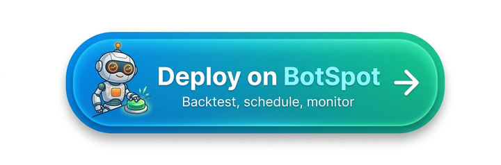

Backtesting
************************

Lumibot has multiple modes for backtesting:

1. **Yahoo Backtesting:** Daily stock backtesting with data from Yahoo.
2. **Pandas Backtesting:** Intra-day and inter-day testing of stocks and futures using CSV data supplied by you.
3. **Polygon Backtesting:** Intra-day and inter-day testing of stocks and futures using Polygon data from polygon.io.
4. **DataBento Backtesting:** Backtesting with high-quality data from DataBento for stocks, futures, and options.
5. **ThetaData Backtesting:** Backtesting with ThetaData (via the LumiBot Data Downloader).
6. **Interactive Brokers (REST) Backtesting:** Backtesting with IBKR Client Portal Gateway (via the LumiBot Data Downloader).
7. **Polymarket Backtesting:** Prediction-contract backtesting from real Polymarket price history.

It is recommended to use Yahoo Backtesting for daily stock backtesting, ThetaData Backtesting for stocks/options/index data, Interactive Brokers (REST) Backtesting for futures and crypto data, and Polymarket Backtesting for Polymarket prediction-contract strategies. Pandas Backtesting is an advanced feature that allows you to test any type of data you have in CSV format but requires more work to setup and is not recommended for most users.

Managed Backtesting on BotSpot
==============================

Backtesting is better on `BotSpot <https://botspot.trade/sales?showLogin=1&utm_source=documentation&utm_medium=backtesting&utm_campaign=lumibot&utm_content=managed_backtesting_text&sample=lumibot_deploy_sample>`_ when you want to move faster than a local setup. BotSpot already has the workflow around Lumibot: hosted data setup, parallel backtest workers, generated artifacts, charts, logs, and the path from a passing backtest into paper or live trading.

- **Backtesting data included.** Use supported hosted stock, futures, options, macro, filings, and other data sources without sourcing every vendor, API key, downloader, and local file yourself. Some data is included; premium datasets can be much cheaper than buying direct subscriptions.
- **Parallel experiments.** Launch multiple strategy variants on BotSpot servers and compare results instead of waiting for one local run at a time.
- **Better artifacts.** Inspect charts, trades, logs, files, decisions, and audit history from one place instead of stitching together local output folders.
- **Lumibot-tuned iteration.** BotSpot's AI workflows and MCP tools understand Lumibot strategy structure, so Codex, Claude Code, Cursor, and other agents can run backtests and inspect results instead of only editing Python.
- **Ready for deployment.** A strategy that survives backtesting can move into paper or live trading with supported broker connections, monitoring, alerts, and kill-switch controls already available.

Agentic Backtesting
===================

Lumibot also supports **agentic backtesting**. A strategy can create one or more AI agents, run them from normal lifecycle methods, analyze point-in-time data with DuckDB, and replay identical agent runs from cache on the next backtest instead of paying for another model call.

This matters if you want:

- an **AI trading agent** that makes decisions inside ``on_trading_iteration()``
- an **LLM trading bot** that can also be tested historically
- external **MCP tools** attached to a strategy
- backtest/live parity for agent-driven strategies

See :doc:`agents` for the full agent runtime guide and usage examples.

Files Generated from Backtesting
================================

When you run a backtest, several important files are generated, each prefixed by the strategy name and the date. These files provide detailed insights into the performance and behavior of the strategy.

.. toctree::
   :maxdepth: 2
   :caption: Contents:

   backtesting.how_to_backtest
   backtesting.backtesting_function
   backtesting.performance
   backtesting.yahoo
   backtesting.pandas
   backtesting.polygon
   backtesting.databento
   backtesting.thetadata
   backtesting.ibkr
   backtesting.tearsheet_html
   backtesting.trades_files
   backtesting.indicators_files
   backtesting.logs_csv
