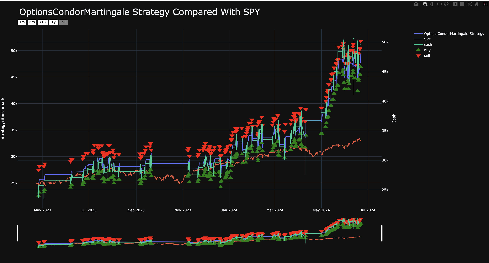

.. _backtesting.trades_files:

Trades Files
============

.. meta::
   :description: The Trades HTML and Trades CSV files provide detailed information about each trade executed by the strategy. This includes: LumiBot documentation.

The **Trades HTML** and **Trades CSV** files provide detailed information about each trade executed by the strategy. This includes:

- **Buy and Sell Orders:** The times and prices at which buy or sell orders were placed, along with the asset involved (e.g., option strike price or stock ticker).
- **Cash-Adjusted Portfolio Value:** The primary strategy-equity line used for cashflow-correct performance review.
- **Portfolio Value:** The raw account value at each time point.
- **Cash:** The amount of cash available at each time point.

Cash Events
-----------

`trades.csv` / `trades.parquet` now also contain non-trade cash-impacting events in the same event stream.

- Trade rows use ``event_kind=trade``.
- Cash rows use ``event_kind=cash_event``.
- Cash rows can include:
  - ``cash_event_type`` (for example ``deposit``, ``withdrawal``, ``interest``, ``fee``)
  - ``cash_event_amount``
  - ``cash_event_reason``
  - ``cash_event_direction``
  - ``is_external_cash_flow``

`trades.html` renders these cash rows as chart markers so deposits, withdrawals, and financing events are visible in
the same review artifact as trade fills.

See also: :doc:`cash_accounting`

Position average entry price
----------------------------

In backtesting, ``position.avg_fill_price`` represents the weighted entry price
of the remaining position. Adding exposure updates that average from actual fill
quantities, including partial fills. Selling part of a long position or covering
part of a short leaves its entry basis unchanged. A fill that reverses the
position opens the remaining opposite-side exposure at that fill's price.
Closing the position clears its basis. Unknown entry basis stays unknown.

This value is distinct from an individual order's average fill price and from
realized profit or loss. Strategies calculating stops from position basis should
read the current position after fills rather than retaining the first entry price.

When ``benchmark_asset=None``, the trade CSV is still exported. Without a
benchmark comparison plot it uses the full trade-event format, including
``status=fill`` rows. Disabling a benchmark must not remove execution evidence.

Option Lifecycle Statuses
-------------------------

For options backtests, expiration outcomes are exported as explicit lifecycle events in the trade artifacts.

- ``cash_settled``: cash settlement at intrinsic value (used for cash-settled products, such as index options).
- ``assigned``: short in-the-money physically-settled option assignment at expiration.
- ``exercised``: long in-the-money physically-settled option exercise at expiration.
- ``expired``: out-of-the-money expiration (or long ITM contracts that cannot be exercised due to account constraints in simulation).

When physical settlement occurs, LumiBot also writes the underlying delivery row as a separate trade event
(``status=fill``) with ``type`` set to the originating lifecycle event (for example, ``type=assigned`` or
``type=exercised``). This allows downstream charting/reporting systems to distinguish ordinary trades from
assignment/exercise delivery.

