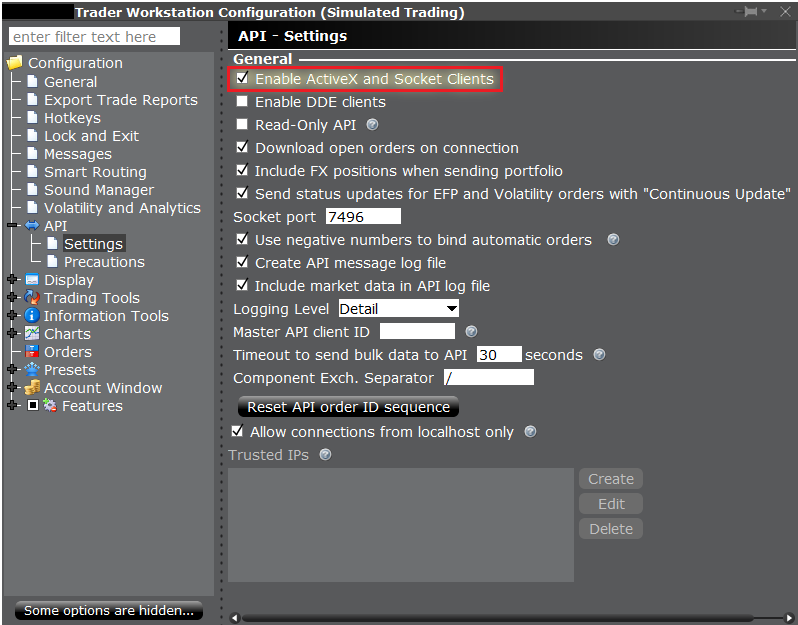

Interactive Brokers
===================================

To trade in your interactive brokers account, you must install Trader Workstation (or Gateway). Instructions for installation can be found here: https://interactivebrokers.github.io/tws-api/initial_setup.html

Once installed, navigate in Trader Workstation to ``File -> Global Configuration -> API -> Settings`` The key settings required to trade using Lumibot are:

#. Enable ActiveX and Socket Clients
#. Disable Read-Only API
#. Socket port ``7496`` for live trading, ``7497`` for paper account trading.
    * NOTE: It is highly recommended to thoroughly test your algorithm in paper trading mode before trading live.
#. Master API Client ID: You can find in the Trader Workstation by going to ``File -> Global Configurations -> API -> Settings``, then looking for "Master API client ID". This can be any number you choose up to ``999``. You will use this in your configuration file to log in.

Set up your credentials as follows in ``credentials.py``:

.. code-block:: python

    INTERACTIVE_BROKERS_CONFIG = {
        "SOCKET_PORT": 7497,
        "CLIENT_ID": "your Master API Client ID three digit number",
        "IP": "127.0.0.1",
    }

Set up your entry point file as above, except using Interactive Brokers. Here is an example of a completed file:

.. code-block:: python
    :emphasize-lines: 3,12

    from lumibot.traders import Trader
    # Import interactive brokers
    from lumibot.brokers import InteractiveBrokers
    from lumibot.strategies.examples import Strangle
    from credentials import INTERACTIVE_BROKERS_CONFIG

    trader = Trader()
    # Initialize interactive brokers
    interactive_brokers = InteractiveBrokers(INTERACTIVE_BROKERS_CONFIG)

    strategy = Strangle(broker=interactive_brokers)
    trader.add_strategy(strategy)
    trader.run_all()

You can also see the file simple_start_ib.py for a working bot here: https://github.com/Lumiwealth/lumibot/blob/master/getting_started/simple_start_ib.py