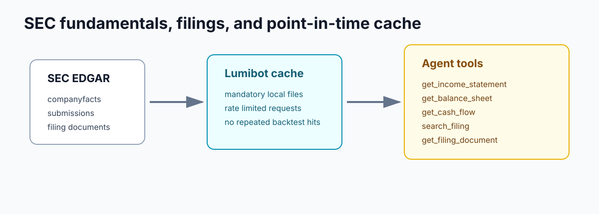

SEC Fundamentals
================

LumiBot includes native SEC EDGAR fundamentals for US equities. These tools use
public SEC APIs directly, require no API key, and cache responses locally.

Available strategy methods:

.. code-block:: python

   self.fundamentals.get_income_statement("AAPL")
   self.fundamentals.get_balance_sheet("AAPL")
   self.fundamentals.get_cash_flow("AAPL")
   self.fundamentals.get_company_facts("AAPL")
   self.fundamentals.get_filings("AAPL", form="10-K")
   self.fundamentals.search_filing("AAPL", accession_number="...", query="risk")
   self.fundamentals.get_filing_document("AAPL", accession_number="...")

Point-In-Time Behavior
----------------------

Backtests must not see future financial statements or filings. LumiBot gates SEC
facts and filings by the current strategy datetime unless you explicitly pass
``as_of``. For facts, the SEC ``filed`` date is used. For filings, the SEC
acceptance datetime is used when available, with filing date as the fallback.

Caching
-------

SEC responses are cached under ``~/.lumibot/cache/sec`` by default. Override this
with ``LUMIBOT_SEC_CACHE_DIR``. LumiBot also rate limits SEC requests and sends a
contact-style user agent. Override the default with ``LUMIBOT_SEC_USER_AGENT``.

Agent Tools
-----------

Agents receive these built-ins:

- ``get_income_statement``
- ``get_balance_sheet``
- ``get_cash_flow``
- ``get_company_facts``
- ``get_filings``
- ``search_filing``
- ``get_filing_document``

Prefer ``search_filing`` before reading a full filing document. Annual reports
and quarterly filings can be long, and search keeps the model context focused.
