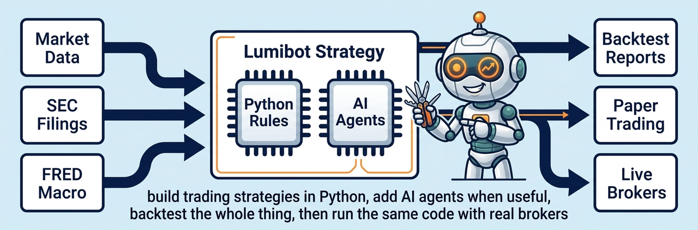
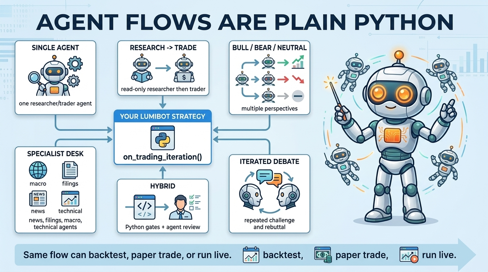
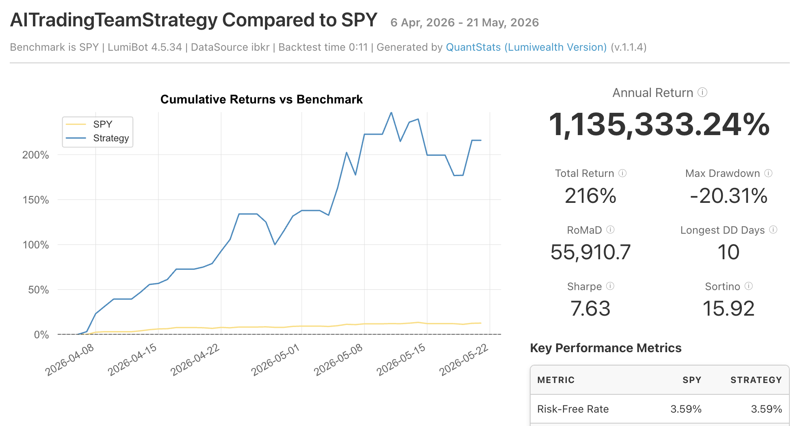

Lumibot: Backtestable AI Agents and Python Algorithmic Trading
==============================================================

**Build deterministic trading strategies, AI trading agents, and AI trading teams for stocks, options, crypto, futures, forex, prediction markets, SEC filings, FRED macro data, technical indicators, and real brokers. Backtest, paper trade, or run live with the same Python code.**

.. raw:: html
   :file: _html/community_links.html

.. raw:: html
   :file: _html/main.html

Getting Started
****************

After you have installed Lumibot on your computer, you can create a strategy and backtest it using free data available from Yahoo Finance, or use your own data. Here's how to get started:

Step 1: Install Lumibot
------------------------

.. note::

   **Ensure you have installed the latest version of Lumibot**. Upgrade using the following command:

   .. code-block:: bash

       pip install lumibot --upgrade

Install the package on your computer:

.. code-block:: bash

    pip install lumibot

Step 2: Create a Strategy for Backtesting
------------------------------------------

Here's some code to get you started:

.. code-block:: python

    from datetime import datetime
    from lumibot.backtesting import YahooDataBacktesting
    from lumibot.strategies import Strategy

    # A simple strategy that buys AAPL on the first day and holds it
    class MyStrategy(Strategy):
        def on_trading_iteration(self):
            if self.first_iteration:
                aapl_price = self.get_last_price("AAPL")
                quantity = self.portfolio_value // aapl_price
                order = self.create_order("AAPL", quantity, "buy")
                self.submit_order(order)

    # Pick the dates that you want to start and end your backtest
    backtesting_start = datetime(2020, 11, 1)
    backtesting_end = datetime(2020, 12, 31)

    # Run the backtest
    MyStrategy.backtest(
        YahooDataBacktesting,
        backtesting_start,
        backtesting_end,
    )

Step 3: Take Your Bot Live
---------------------------

Once you have backtested your strategy and understand how it behaves on historical data, you can take your bot to paper trading or live trading. Notice how the strategy code is exactly the same. Here's an example using Alpaca (you can create a free Paper Trading account here in minutes: `https://alpaca.markets/ <https://alpaca.markets/>`_).

.. code-block:: python

   from lumibot.brokers import Alpaca
   from lumibot.strategies.strategy import Strategy
   from lumibot.traders import Trader

   ALPACA_CONFIG = {
        "API_KEY": "YOUR_ALPACA_API_KEY",
        "API_SECRET": "YOUR_ALPACA_SECRET",
        "PAPER": True  # Set to True for paper trading, False for live trading
    }

   # A simple strategy that buys AAPL on the first day and holds it
   class MyStrategy(Strategy):
      def on_trading_iteration(self):
         if self.first_iteration:
               aapl_price = self.get_last_price("AAPL")
               quantity = self.portfolio_value // aapl_price
               order = self.create_order("AAPL", quantity, "buy")
               self.submit_order(order)

   trader = Trader()
   broker = Alpaca(ALPACA_CONFIG)
   strategy = MyStrategy(broker=broker)

   # Run the strategy live
   trader.add_strategy(strategy)
   trader.run_all()

.. important::

   **Remember to start with a paper trading account** to ensure everything works as expected before moving to live trading.

AI Trading Team
***************

LumiBot is built for **AI agents that reason, call external tools, and make trading decisions on every bar during a backtest** -- then run the exact same code live. This is real agentic backtesting: the LLM is inside the simulation loop, not bolted onto the side.

Classic Python strategies are still first-class. LumiBot lets you choose the right level of intelligence: fixed rules, AI agents, or a hybrid where Python handles the hard gates and agents reason through evidence.

- **Backtest AI trading agents** with real external data from 20,000+ MCP servers
- **LLM in the loop on every bar** -- the agent reasons over point-in-time market state, calls tools, and submits orders
- **Replay caching** makes warm backtest reruns deterministic and fast (zero LLM calls on rerun)
- **Any LLM provider per agent** -- use a cheaper model for evidence gathering and a stronger model for debate/trading
- **Built-in SEC fundamentals and filings** -- agents can inspect income statements, balance sheets, cash flow, company facts, and annual reports
- **Built-in FRED macro data** -- agents can inspect rates, inflation, labor, growth, liquidity, credit spreads, and market-risk series
- **Trading permissions** -- research agents can use read-only tools while portfolio-manager agents place orders
- **Same code for backtest and live** -- write once, backtest it, deploy it
- **External MCP servers are just a URL** -- no local scripts, no npm installs

Key AI agent docs:

- :doc:`agents` -- main guide: agentic backtesting framework, MCP trading tools, and competitive positioning
- :doc:`agents_flows` -- design single-agent, multi-agent, debate, team, and hybrid flows
- :doc:`agents_examples` -- copy-paste AI trading team examples, including leveraged ETFs, large-cap stocks, Ray Dalio idea meritocracy, Warren Buffett value, Bill Ackman concentrated, and Citadel sector pods
- :doc:`fundamentals` -- SEC fundamentals and filing research tools
- :doc:`macro_data` -- FRED macro data tools and point-in-time behavior
- :doc:`agents_builtin_tools` -- built-in tools, indicators, and trading permissions
- :doc:`agents_quickstart` -- quick start with code examples for AI agent backtesting
- :doc:`agents_canonical_demos` -- three reference demos: news sentiment, macro risk, and M2 liquidity
- :doc:`agents_observability` -- traces, replay cache, warnings, and debugging workflow

Design Your AI Trading Team
***************************

An AI trading team is just a group of agents with different jobs inside the same LumiBot strategy. You can build a single-agent strategy, a specialist research flow, bull/bear/neutral teams, model-vs-model debates, deterministic execution gates, or agent reviewers layered on top of normal Python logic.

Example: Research, Bull, Bear, and Trader Agents
************************************************

Here is one example pattern: a researcher gathers evidence, bull and bear agents debate the trade, and a trader agent decides what to buy or sell.

.. image:: ../docs/assets/readme/lumibot_investment_committee_architecture.png
   :alt: Lumibot AI trading team workflow
   :width: 100%
   :class: lumibot-doc-image

In this pattern, each agent has a job:

1. **Research Agent:** builds the evidence pack from market data, filings, fundamentals, news, macro data, and indicators.
2. **Bull Agent:** turns that evidence into the strongest long thesis.
3. **Bear Agent:** challenges the thesis, looks for risk, and argues for avoiding, delaying, or reducing the trade.
4. **Trader / Portfolio Manager Agent:** checks cash, positions, open orders, and risk limits, then decides whether to trade.

The copy-paste example below implements that exact team. It uses Gemini Flash Lite because it is fast and inexpensive for experiments.

To run it with a broker in paper mode, set your AI and Alpaca credentials and run the file:

.. code-block:: bash

    export GEMINI_API_KEY='your-key-here'
    export ALPACA_API_KEY='your-alpaca-key'
    export ALPACA_API_SECRET='your-alpaca-secret'
    export ALPACA_IS_PAPER=true
    python ai_trading_team_bull_bear_leveraged_etf.py

To backtest the same strategy instead, change ``IS_BACKTESTING = False`` to ``IS_BACKTESTING = True`` in the runner:

.. code-block:: bash

    export GEMINI_API_KEY='your-key-here'
    python ai_trading_team_bull_bear_leveraged_etf.py

Save this as ``ai_trading_team_bull_bear_leveraged_etf.py``. If an AI key is missing or invalid, LumiBot stops and prints a clear provider key error with a link to create a key.

.. code-block:: python

    import os
    from datetime import datetime

    from lumibot.strategies.strategy import Strategy

    class AITradingTeamBullBearLeveragedETFStrategy(Strategy):
        parameters = {
            "universe": ["TQQQ", "SQQQ", "UPRO", "SPXU", "UDOW", "SDOW", "TNA", "TZA", "TECL", "TECS", "SOXL", "SOXS", "WEBL", "WEBS", "FAS", "FAZ", "LABU", "LABD", "ERX", "ERY", "GUSH", "DRIP", "DRN", "DRV", "TMF", "TMV", "NUGT", "DUST"],
        }

        def initialize(self):
            self.sleeptime = "1D"
            model = os.environ.get("AI_TRADING_TEAM_MODEL", "gemini-3.1-flash-lite")
            # The first three agents are read-only. They can reason, but cannot trade.
            self.agents.create(
                name="researcher",
                model=model,
                allow_trading=False,
                system_prompt="Rank the ETFs by upside. Be direct.",
            )
            self.agents.create(
                name="bull",
                model=model,
                allow_trading=False,
                system_prompt="Argue for the strongest money-making trade.",
            )
            self.agents.create(
                name="bear",
                model=model,
                allow_trading=False,
                system_prompt="Point out the biggest risk, briefly.",
            )
            # Only this final agent can submit orders through Lumibot.
            self.agents.create(
                name="trader",
                model=model,
                allow_trading=True,
                system_prompt="Buy one ETF from the universe aggressively. Use nearly all cash.",
            )

        def on_trading_iteration(self):
            # Each trading day, pass the same market context through the team.
            context = {
                "date": self.get_datetime().date().isoformat(),
                "universe": self.parameters["universe"],
            }
            research = self.agents["researcher"].run(
                task_prompt="Pick the strongest ETF.",
                context=context,
            )
            bull = self.agents["bull"].run(
                task_prompt="Make the bull case.",
                context={**context, "research": research.summary},
            )
            bear = self.agents["bear"].run(
                task_prompt="Make the bear case.",
                context={**context, "research": research.summary, "bull": bull.summary},
            )
            self.agents["trader"].run(
                task_prompt="Sell anything that is not the pick, then buy the best ETF with nearly all available cash.",
                context={**context, "research": research.summary, "bull": bull.summary, "bear": bear.summary},
            )

    if __name__ == "__main__":
        IS_BACKTESTING = False

        if IS_BACKTESTING:
            from lumibot.backtesting import YahooDataBacktesting

            AITradingTeamBullBearLeveragedETFStrategy.backtest(
                YahooDataBacktesting,
                datetime(2026, 4, 7),
                datetime(2026, 5, 22),
            )
        else:
            from lumibot.brokers import Alpaca
            from lumibot.traders import Trader

            ALPACA_CONFIG = {
                "API_KEY": os.environ["ALPACA_API_KEY"],
                "API_SECRET": os.environ["ALPACA_API_SECRET"],
                "PAPER": os.environ.get("ALPACA_IS_PAPER", "true").lower() != "false",
            }

            broker = Alpaca(ALPACA_CONFIG)
            strategy = AITradingTeamBullBearLeveragedETFStrategy(broker=broker)

            trader = Trader()
            trader.add_strategy(strategy)
            trader.run_all()

Example backtest artifact from this sample strategy:

The result is intentionally eye-catching, but the exact percentage is not the point. The point is that the full AI trading team runs inside Lumibot's normal broker and backtest loops, so the decisions, orders, and artifacts are inspectable before you connect real money. Backtests are not expected future performance.

`See this AI trading team running live on BotSpot <https://botspot.trade/marketplace/strategy/4aa43848-54d6-48bf-b2e4-b266f9fec6ad>`__

More AI Trading Team Examples
*****************************

These examples show different ways to organize an AI trading team. Each page explains the inspiration, the agent flow, how to run it with a broker in paper mode, and how to backtest it.

1. :doc:`agents_example_citadel_sector_pods` -- inspired by the pod-style structure associated with Ken Griffin's Citadel: sector specialists pitch their best ideas, a risk manager challenges crowding and drawdown risk, and a portfolio manager rotates into the strongest sector ETF. `Watch it live on BotSpot <https://botspot.trade/marketplace/strategy/0b4576c7-f78b-4477-ba3a-630758fb0168>`__.
2. :doc:`agents_example_warren_buffett_value` -- uses AI agents like a patient value-investing desk: one agent digs into business quality and annual reports, one demands valuation discipline, and the portfolio manager only buys the best long-term compounder. `Watch it live on BotSpot <https://botspot.trade/marketplace/strategy/bdd324e9-8026-4115-b26e-30cccf6e00e8>`__.
3. :doc:`agents_example_ray_dalio_idea_meritocracy` -- turns Bridgewater-style thoughtful disagreement into a macro ETF workflow, with growth, inflation, liquidity, and disagreement agents arguing before the trader acts. `Watch it live on BotSpot <https://botspot.trade/marketplace/strategy/81af73b8-7dec-4941-ba35-d5a06fee6863>`__.
4. :doc:`agents_example_bill_ackman_concentrated` -- inspired by Pershing Square-style concentrated investing: find one great business, make the activist bull case, attack it like a short seller, then let the portfolio manager take a focused position if the thesis survives. `Watch it live on BotSpot <https://botspot.trade/marketplace/strategy/d56d5bf1-293b-44d8-a18c-bdda969b82f3>`__.
5. :doc:`agents_example_bull_bear_leveraged_etf` -- a fast, aggressive demo where bull and bear agents debate leveraged long and inverse ETFs before the trader rotates into one high-conviction ETF. `Watch it live on BotSpot <https://botspot.trade/marketplace/strategy/4aa43848-54d6-48bf-b2e4-b266f9fec6ad>`__.
6. :doc:`agents_example_bull_bear_large_cap_stocks` -- the same debate structure applied to familiar large-cap stocks, which makes it easier to inspect each agent's reasoning before using more volatile instruments. `Watch it live on BotSpot <https://botspot.trade/marketplace/strategy/932f3661-c552-4723-b247-869518a5d30f>`__.

Cash Accounting
***************

Lumibot supports explicit cash accounting for both backtests and live broker
telemetry. Use the strategy cash methods for deposits, withdrawals, direct
cash adjustments, and financing setup, then review the resulting
cash-adjusted returns in the standard backtest artifacts.

- Backtests keep external cashflows out of strategy performance
- Live cloud payloads can include normalized broker ``cash_events``
- Listener storage keeps raw normalized events in a dedicated event table

Start with :doc:`cash_accounting` for the end-to-end guide.

Additional Resources
********************

If you would like to learn how to modify your strategies, we suggest that you first learn about Lifecycle Methods, then Strategy Methods, and Strategy Properties. You can find the documentation for these in the menu, with the main pages describing what they are, then the sub-pages describing each method and property individually.

We also have some more sample code that you can check out here: `https://github.com/Lumiwealth/lumibot/tree/dev/lumibot/example_strategies <https://github.com/Lumiwealth/lumibot/tree/dev/lumibot/example_strategies>`_

Next, explore the AI agent docs if you want a strategy that researches evidence, debates bull and bear cases, checks risk, and trades from the same Python lifecycle.

Need Extra Help?
****************

If you want a guided path instead of piecing everything together from docs, start with the AI Trading Bootcamp. It teaches the full workflow: turn an idea into a Lumibot strategy, backtest it, inspect the artifacts, connect a broker, and decide when it is ready for paper or live trading.

BotSpot is the cheaper, easier way to run Lumibot once you want hosted data, parallel backtests, broker connections, monitoring, alerts, audit history, and scheduled deployment without maintaining your own trading server.

.. raw:: html
   :file: _html/course_list.html

Why Lumibot?
************

AI trading projects have proved that people want agentic trading workflows.
Lumibot's edge is that those workflows run inside a real Python trading
framework. You can backtest the agent decisions, inspect the artifacts, add
normal Python guardrails, paper trade, and connect to brokers without
rewriting the strategy.

That matters because an AI trading demo is not the same thing as a trading
system. Without backtests and broker-aware strategy code, you are mostly
trusting prompts. Lumibot lets you iterate faster: test the agent flow on
historical data, see what it would have bought or sold, tighten the Python
risk checks, then run the same lifecycle in paper or live trading.

Compared With AI Trading Agent Projects
---------------------------------------

.. list-table::
   :header-rows: 1
   :widths: 18 18 18 20 18

   * - Project
     - AI trading teams
     - Backtest decisions
     - Paper/live broker path
     - Hosted deploy/monitoring
   * - Lumibot + BotSpot
     - Flexible teams, single agents, debates, hybrid flows, and deterministic gates
     - Yes: replayable decisions, orders, traces, artifacts, charts, logs
     - Yes: Alpaca, IBKR, Tradier, Schwab, Tradovate, ProjectX, Bitunix, selected CCXT
     - Yes: hosted data, parallel backtests, deployment, monitoring, MCP, alerts, kill switches
   * - TradingAgents
     - Yes, focused on a specific multi-agent research structure
     - Research/demo oriented
     - Not the main focus
     - No
   * - ai-hedge-fund
     - Yes, focused on named investor-style agents
     - Demo/backtest oriented
     - Not the main focus
     - No
   * - OpenAlice
     - Yes, one-person Wall Street agent concept
     - Experimental
     - Local/self-run focus
     - No
   * - QuantDinger
     - Yes
     - Yes
     - Crypto, IBKR, MT5, Alpaca
     - Self-hosted
   * - Vibe-Trading
     - Yes, personal trading agent flow
     - Yes
     - Agent platform focus
     - Platform-specific
   * - AI-Trader
     - Yes
     - Platform focus
     - Platform focus
     - Platform-specific
   * - OpenBB
     - Tooling for agents
     - Not a strategy backtester
     - No broker execution framework
     - OpenBB platform
   * - Qlib
     - Research/ML agents
     - Quant research backtests
     - Limited live focus
     - No

Read the detailed comparison page: :doc:`ai_trading_project_comparison`.

Polymarket Trading And Backtesting
----------------------------------

LumiBot supports Polymarket prediction-contract trading and backtesting through the normal broker, data-source, and
backtesting abstractions. Strategies can search markets, resolve outcomes to CLOB token ids, read order books and
quotes, inspect market rules and resolution status, backtest historical Polymarket prices, and submit live orders using
``create_order`` and ``submit_order``.

Start with the full setup and reference guide: :doc:`brokers.polymarket`.

Compared With Backtesting Libraries
-----------------------------------

.. list-table::
   :header-rows: 1
   :widths: 18 18 18 18 18 18

   * - Library
     - Same code: backtest + live
     - Assets
     - AI agent runtime
     - Broker/live path
     - Hosted deployment
   * - Lumibot
     - Yes
     - Stocks, options, crypto, futures, forex, prediction markets
     - Built-in
     - Alpaca, IBKR, Tradier, Schwab, Tradovate, ProjectX, Bitunix, Polymarket, selected CCXT
     - BotSpot
   * - Backtrader
     - Yes
     - Stocks, limited crypto/futures, outdated forex
     - No
     - IB only/outdated
     - No
   * - Freqtrade
     - Crypto
     - Crypto
     - FreqAI/ML
     - Crypto exchanges
     - No
   * - Zipline
     - No
     - Stocks
     - No
     - None
     - No
   * - Backtesting.py
     - No
     - Stocks, crypto, futures, forex
     - No
     - None
     - No
   * - vectorbt
     - No
     - Stocks, crypto, futures, forex
     - No
     - No
     - No
   * - NautilusTrader
     - Yes
     - Stocks, crypto, futures, forex, limited options
     - No
     - Exchange adapters
     - No
   * - Hummingbot
     - Crypto
     - Crypto market making
     - Scripts/controllers
     - Crypto exchanges
     - Ecosystem/enterprise options

Table of Contents
*****************

.. toctree::
   :maxdepth: 2

   Home <self>
   Build and Deploy with BotSpot <https://botspot.trade/sales?showLogin=1&utm_source=documentation&utm_medium=sidebar&utm_campaign=lumibot&utm_content=sidebar_build_bots&sample=lumibot_deploy_sample>
   BotSpot MCP Integration <botspot_mcp>
   GitHub <https://github.com/Lumiwealth/lumibot>
   Reddit Community <https://www.reddit.com/r/BotSpotTrade/>
   Discord Community <https://discord.gg/lumiwealth>
   getting_started
   imports_and_startup
   agents
   ai_trading_project_comparison
   cash_accounting
   lifecycle_methods
   strategy_methods
   strategy_properties
   entities
   indicators
   fundamentals
   macro_data
   backtesting
   brokers
   reference
   examples
   deployment
   common_mistakes
   faq
   Get Pre-Built Strategies <https://botspot.trade/marketplace?utm_source=documentation&utm_medium=sidebar&utm_campaign=lumibot&utm_content=sidebar_marketplace>

Indices and tables
==================

* :ref:`genindex`
* :ref:`modindex`
* :ref:`search`
