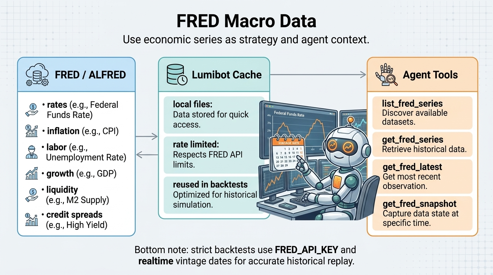

FRED Macro Data
===============

.. meta::
   :description: LumiBot includes native Federal Reserve Economic Data (FRED) macro tools for strategies and AI agents.

LumiBot includes native Federal Reserve Economic Data (FRED) macro tools for
strategies and AI agents. Use these tools for interest rates, inflation,
employment, growth, liquidity, credit spreads, and market-risk context.

FRED Strategy API
-----------------

.. code-block:: python

   self.macro.list_series()
   self.macro.get_series("DGS10")
   self.macro.get_latest("UNRATE")
   self.macro.get_snapshot(["FEDFUNDS", "DGS10", "CPIAUCSL", "UNRATE"])

FRED Agent Tools
----------------

Agents receive these FRED built-ins automatically:

- ``list_fred_series``
- ``get_fred_series``
- ``get_fred_latest``
- ``get_fred_snapshot``

These tools are available to read-only research agents and trading-enabled
portfolio agents. They do not submit, cancel, or modify orders.

FRED API Key Behavior
---------------------

``FRED_API_KEY`` is required for the official FRED/ALFRED API path and for
FRED macro data fetches.

This FRED credential is not used by FXMacroData. FXMacroData access is
described separately below.

LumiBot uses the official API path instead of public CSV fallbacks so tool
output has a clear provenance and backtests can request point-in-time vintage
observations.

With a key, LumiBot passes ``realtime_start`` and ``realtime_end`` based on the
strategy datetime so the backtest sees the vintage observations that were
available at that time.

Built-in FRED agent tools are hidden during backtests unless ``FRED_API_KEY`` is
configured. This prevents agents from accidentally using macro data without a
point-in-time data contract in historical simulations.

Backtest Date Safety
--------------------

In a backtest, ``as_of`` defaults to ``self.get_datetime()``.

LumiBot always filters observations to ``observation_date <= as_of`` and
requests the vintage data known as of that date through the official API.

Cache
-----

FRED data is cached under ``~/.lumibot/cache/fred`` by default. Override this
with ``LUMIBOT_FRED_CACHE_DIR``.

See :doc:`standalone_components` for use in scripts and notebooks.

FXMacroData Macro Releases
==========================

LumiBot also includes an FXMacroData provider for FX-focused macro announcement
rows:

.. code-block:: python

   self.macro.fxmacrodata.list_indicators()
   self.macro.fxmacrodata.get_series("eur", "inflation")
   self.macro.fxmacrodata.get_latest("jpy", "policy_rate")
   self.macro.fxmacrodata.get_snapshot("gbp", ["inflation", "policy_rate", "unemployment"])

FXMacroData agents receive these read-only built-ins automatically:

- ``list_fxmacrodata_indicators``
- ``get_fxmacrodata_series``
- ``get_fxmacrodata_latest``
- ``get_fxmacrodata_snapshot``

USD announcement data is public. Set ``FXMD_API_KEY`` or
``FXMACRODATA_API_KEY`` for non-USD and paid endpoint access. LumiBot sends the
key as an ``X-API-Key`` header, not as an ``api_key`` query parameter.

In a backtest, ``as_of`` defaults to ``self.get_datetime()``. LumiBot drops
rows whose ``announcement_datetime`` is after ``as_of``, and also drops rows the
API returns without an announcement datetime, because their period date usually
precedes the real release. Outside backtests those rows are kept, gated on their
period date, and marked ``gated_on: "period_date"`` (other rows carry
``gated_on: "announcement_datetime"``); treat them as approximate. Rows with no
parseable date at all are dropped. ``get_latest`` keeps paging back until it
finds a row published by ``as_of`` or the data runs out.

This is not a blanket point-in-time guarantee. Each result includes a
``publication_time`` summary with counts of rows with and without an
announcement datetime, rows dropped as undated or (in backtests) for lacking an
announcement datetime, an ``approximate`` flag that is true when any returned
row was gated on its period date, and ``publication_time_status`` values. Each row keeps the API's ``publication_time_status``; only
``confirmed`` means the timestamp was taken from the publisher's own release.

In backtests, FXMacroData responses are cached under
``~/.lumibot/cache/fxmacrodata`` by default. Override this with
``LUMIBOT_FXMACRODATA_CACHE_DIR``.
