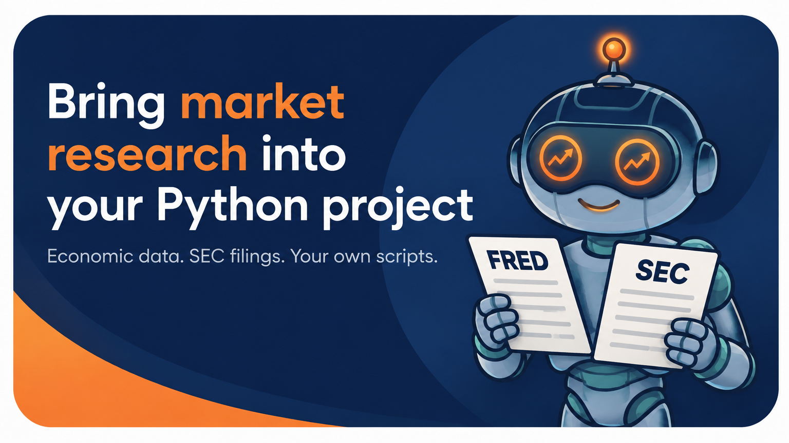

Use LumiBot in another Python project
=====================================

.. meta::
   :description: Use LumiBot FRED macro and SEC research helpers in scripts and notebooks without creating a trading Strategy. Reuse indicator functions and agent tools.

You can use selected research components without running a trading strategy.
The examples below are network reads, not backtests or broker connections.

Read macro data
---------------

.. code-block:: python

   import os
   from lumibot.macro import FREDMacroData

   macro = FREDMacroData(api_key=os.environ["FRED_API_KEY"])
   result = macro.get_series(
       "UNRATE", start="2024-01-01", end="2024-12-31", as_of="2025-01-15"
   )
   print(result)

Set ``FRED_API_KEY`` in your environment. ``as_of`` requests the historical
information vintage; observation date and publication date are different.
Inspect the returned data and metadata rather than assuming missing values are
zero. The helper uses its cache and rate pacing; see :doc:`macro_data` for the
full response and historical-data contract.

Read price history
------------------

You can pull bars without a ``Strategy``, a broker, or a backtest. Pass the
dates. This is the part that catches people:

.. code-block:: python

   from datetime import datetime

   from lumibot.data_sources import YahooData
   from lumibot.entities import Asset

   data = YahooData(datetime_start=datetime.now(), datetime_end=datetime.now())
   bars = data.get_historical_prices(Asset("SPY"), 5, "day")
   print(bars.df[["open", "high", "low", "close", "volume"]])
   print(data.get_last_price(Asset("SPY")))

``YahooData`` is a backtesting data source, so it holds a simulated clock and
answers every request **as of that clock**. Construct it with no dates and
``datetime_start`` defaults to now minus 365 days, the clock sits at the start of
that window, and ``get_historical_prices`` hands back bars from a year ago
without warning you. The numbers look plausible and are twelve months stale.

Pass ``datetime_start=datetime.now()`` for a present-day read, or pass the exact
historical date you mean to study. Either way, state it; never rely on the
default.

The same applies to every backtesting data source, including
:doc:`Polygon <backtesting.polygon>` and :doc:`DataBento <backtesting.databento>`.
For a live broker feed instead, use the broker's own data source; see
:doc:`brokers`.

Read SEC submissions
---------------------

.. code-block:: python

   import os
   from lumibot.fundamentals import SECFundamentals

   sec = SECFundamentals(user_agent=os.environ["LUMIBOT_SEC_USER_AGENT"])
   submissions = sec.get_submissions("AAPL")
   print(submissions)

SEC requests need a descriptive User-Agent with your contact information.
The submissions response contains filing metadata; it is not a reconstructed
historical portfolio. Inspect filing/publication dates before using it in a
historical decision. See :doc:`fundamentals` for caching and error behavior.
Keep provider exceptions visible so callers can distinguish failed research
from an empty result.

Reuse an indicator function
---------------------------

A normal Python function can be shared between notebooks and strategies:

.. code-block:: python

   def completed_close_average(closes, length=20):
       """Average exactly the last length completed closes, oldest to newest."""
       import math
       if length <= 0 or len(closes) < length:
           raise ValueError("Supply enough completed closes and a positive length")
       values = [float(value) for value in closes[-length:]]
       if not all(math.isfinite(value) for value in values):
           raise ValueError("Closes must be finite")
       return sum(values) / length

The caller owns timestamp ordering, completed-bar selection, and timezone.
Do not pass future rows or the still-forming bar. See :doc:`indicators` for
LumiBot's existing indicator tools and :doc:`agents_quickstart` for
``@agent_tool`` wrappers. A new plugin registry is not required to reuse code.

Use the same function through the existing custom-indicator API when you need
strategy-time history and memoization. Save this reusable function in your own
``my_indicators.py``:

.. code-block:: python

   def rolling_close_average(df, length=20):
       return df["close"].rolling(length, min_periods=length).mean()

Then call it from a strategy lifecycle method:

.. code-block:: python

   from my_indicators import rolling_close_average
   from lumibot.entities import Asset

   result = self.indicators.custom(
       "rolling_close_average", rolling_close_average,
       Asset("SPY"), timestep="day", length=20,
   )

``custom`` accepts a function returning a pandas Series or DataFrame and uses
history available as of strategy time. Keep the indicator name stable and pass
its parameters explicitly. See :doc:`indicators` for the returned result API.

Execution components have a lifecycle
-------------------------------------

``Strategy`` and its ``AgentManager`` own simulated time, account state, and
execution. Broker objects may start threads or streams; they are not all
stateless REST clients. Use :doc:`strategy_api_overview` and :doc:`brokers`
when embedding trading execution, and preserve their startup/shutdown lifecycle.

Learn to build a complete strategy
----------------------------------

Explore the AI Trading Bootcamp with Rob Grzesik for guided training.

